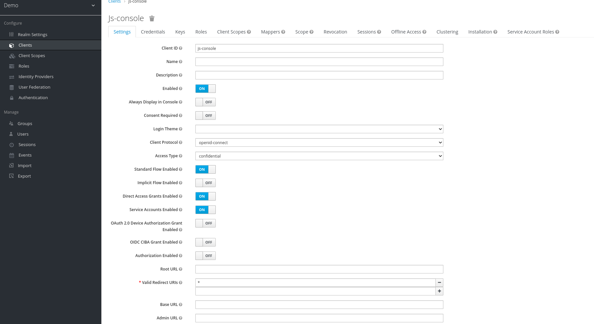

# Quarkus App use SSO in OpenShift

If you have a Quarkus App and wants to add Security whith SSO this is the right place

We start deploying our app in local host for the first approauch 

First, We need clone the repository with the next command

```bash
    git clone https://github.com/trixlan/SSO-quarkus-web.git

    cd SSO-quarkus-web
```

Check in pom.xml file if there are **oidc** dependency

```xml
    <dependency>
        <groupId>io.quarkus</groupId>
        <artifactId>quarkus-oidc</artifactId>
    </dependency>
```

You will add with the next comand

```bash
    ./mvnw quarkus:add-extension -Dextensions="oidc"
```

We need to add some properties in application.properties file which should be located at the **src/main/resources** directory

```properties
    quarkus.oidc.auth-server-url=https://keycloak-sso.apps.cluster-lzrtr.lzrtr.sandbox506.opentlc.com/auth/realms/demo
    quarkus.oidc.client-id=js-console
    quarkus.oidc.credentials.secret=0327ab34-46b3-485b-a8ed-c648dbfa7503

    quarkus.keycloak.devservices.realm-path=quarkus-realm.json
    quarkus.oidc.application-type=web-app
    quarkus.http.auth.permission.authenticated.paths=/*
    quarkus.http.auth.permission.authenticated.policy=authenticated
    
    quarkus.kubernetes-client.trust-certs=true
    quarkus.openshift.route.expose=true
```

Now need to configure the SSO 


Create new realm 


Create new client



Create new user


Create roles and add roles to users


After we have the SSO running, it run the application in OpenShift

```bash
    
```

This is a minimal web application serving a single HTML file and a JAX-RS Resource to serve a HTML content.

Under the hood, this demo uses:

- OpenID Connect Authorization Code Flow to authenticate users

The intent here is to demonstrate how you can enable authentication to your web applications using OpenID Connect, so that your users are redirected to your favorite OpenID Connect Provider(OP) to authenticate and, if the authentication is successful, get redirected back to your application.

Once authenticated, the applications establishes a local session based on the information carried by the `ID Token` that was issued by the OP. The session lifetime is tied with the ID Token lifetime, so when the token expires the local session is invalidated and the user is redirected to the OP to (re-)authenticate. Note that the `quarkus-oidc` tries as much as possible to provide a stateless model for your application, where any state related with the user session is based on specific HTTP cookies.

## Requirements

To compile and run this demo you will need:

- JDK 11+
- GraalVM
- Keycloak

### Configuring GraalVM and JDK 11+

Make sure that both the `GRAALVM_HOME` and `JAVA_HOME` environment variables have
been set, and that a JDK 11+ `java` command is on the path.

See the [Building a Native Executable guide](https://quarkus.io/guides/building-native-image)
for help setting up your environment.

## Building the application

Launch the Maven build on the checked out sources of this demo:

> ./mvnw package

## Starting and Configuring the Keycloak Server

To start a Keycloak Server you can use Docker and just run the following command:

```bash
docker run --name keycloak -e DB_VENDOR=H2 -e KEYCLOAK_USER=admin -e KEYCLOAK_PASSWORD=admin -p 8180:8080 quay.io/keycloak/keycloak:11.0.2
```

You should be able to access your Keycloak Server at [localhost:8180/auth](http://localhost:8180/auth).

Log in as the `admin` user to access the Keycloak Administration Console.
Username should be `admin` and password `admin`.

Import the [realm configuration file](config/quarkus-realm.json) to create a new realm.
For more details, see the Keycloak documentation about how to [create a new realm](https://www.keycloak.org/docs/latest/server_admin/index.html#_create-realm).

### Live coding with Quarkus

The Maven Quarkus plugin provides a development mode that supports
live coding. To try this out:

> ./mvnw quarkus:dev

This command will leave Quarkus running in the foreground listening on port 8080.

1. Visit the default endpoint: [http://127.0.0.1:8080](http://127.0.0.1:8080).
    - You should be redirected to the login page at Keycloak

2. Authenticate as user `alice`
    - Username: `alice`
    - Password: `alice`

3. If the credentials you provided are valid and you were successfully authenticated, you should be redirected back to the application

4. You should be able to access now the `index.html` resource.

5. Visit the `/tokens` endpoint: [http://127.0.0.1:8080/tokens](http://127.0.0.1:8080/tokens).
    - You should have access to a HTML page that shows information based on the ID Token, Access Token and Refresh Token issued
    to the application. Where these tokens are available for injection as you can see in the `TokenResource` JAX-RS Resource.

_NOTE:_ Running the tests with, for instance, `mvn package` requires the Keycloak server to be down as it will launch its own one. However, when running the application, make sure it is up with the realm properly configured.

### Run Quarkus in JVM mode

When you're done iterating in developer mode, you can run the application as a
conventional jar file. First compile it:

> ./mvnw package

Then run it:

> java -jar ./target/quarkus-app/quarkus-run.jar

Have a look at how fast it boots, or measure the total native memory consumption.

### Run Quarkus as a native executable

You can also create a native executable from this application without making any
source code changes. A native executable removes the dependency on the JVM:
everything needed to run the application on the target platform is included in 
the executable, allowing the application to run with minimal resource overhead.

Compiling a native executable takes a bit longer, as GraalVM performs additional
steps to remove unnecessary codepaths. Use the  `native` profile to compile a
native executable:

> ./mvnw package -Dnative

After getting a cup of coffee, you'll be able to run this executable directly:

> ./target/security-openid-connect-web-authentication-quickstart-1.0.0-SNAPSHOT-runner
